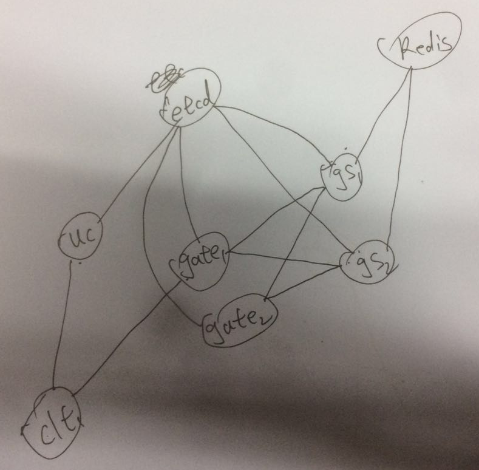

### 服务器架构 

* `gate[N]`: 网关服务器
* `game[N]`: 游戏服务器
* `uc`: 帐号服务器
* `etcd`: 服务发现，实现gs与gate服务器的连接管理
* `redis`: 服务发现，实现gs与gate服务器的连接管理

### 客户端与服务器通信方式

客户端通过http协议进行账号的验证/创建，得到登陆的网关地址后用tcp进行连接。

### 协议格式

协议格式如下图所示:

    +--------------------------------------+
    | size | api_type_size | api | payload |
    +--------------------------------------+

* `size`: int16, 消息总长度(sizeof(api_type_size) + len(api) + len(payload))
* `api_type_size`: int16，为api字符串的长度值
* `api`: string, protobuf对应的名字
* `payload`: bytes, protobuf序列化后的字节块

这里之所以用字符串值做消息类型，而不想通常定义一个枚举值那样，是因为在很多语言里可以通过反射机制根据字符串值找到protobuf类型，可以很方便的进行消息的反序列化，并且不需要每定义个消息就要相应的添加一个枚举值。

### 与账号服务器交互

#### REST API服务器

* `HOST`: qeetap.com:8082 (for test)
* `BASE_URL`: http://qeetap.com:8082  (for test)

#### 账号验证

* `URL`: /v1/account/auth
* `method`: POST
* `参数`:
    - `username`: 用户名(string)
    - `password`: 用户密码(string)
    - `device_id`: 设备唯一ID(string), 游客登陆时只发`device_id`
* `返回值`: json格式，消息结构见`msg.Auth.Res`
    - `code`: 结果码(int32)，成功为0，否则值定义见`def/common.proto`
    - `token`: JWT格式登陆令牌(string)
    - `addr`: 网关服务器地址(string), 格式: `ip:port`
* `Example`:

    curl -X POST -d "username=lisp&password=123" http://qeetap.com:8082/v1/account/auth

#### 账号创建

* `URL`: /v1/account/registry
* `method`: POST
* `参数`
    - `username`: 用户名(string)
    - `password`: 用户密码(string)
* `返回值`: json格式，消息结构见`msg.Auth.Res`
    - `code`: 结果码(int32)，成功为0，否则值定义见`def/common.proto`
    - `token`: JWT格式登陆令牌(string)
    - `addr`: 网关服务器地址(string), 格式: `ip:port`

#### 账号绑定
* `URL`: /v1/account/bind/account
* `method`: POST
* `参数`
    - `account_id`: 账号id(int64)
    - `username`: 用户名(string)
    - `password`: 用户密码(string)
* `返回值`: json格式，消息结构见`msg.BindAccount.Res`
    - `code`: 结果码(int32)，成功为0，否则值定义见`def/common.proto`

#### 手机验证码请求
* `URL`: /v1/verification
* `method`: POST
* `参数`
    - `phone`: 手机号码(string)
* `返回值`: json格式，消息结构见`msg.VerificationCode.Res`
    - `code`: 结果码(int32)，成功为0，否则值定义见`def/common.proto`

#### 账号绑定手机
* `URL`: /v1/account/bind/phone
* `method`: POST
* `参数`
    - `account_id`: 账号id(int64)
    - `password`: 用户密码(string)
    - `phone`: 手机号码(string)
    - `code`: 验证码(string), 绑定消息请求前需要先请求验证码
* `返回值`: json格式，消息结构见`msg.BindPhone.Res`
    - `code`: 结果码(int32)，成功为0，否则值定义见`def/common.proto`

#### 账号密码修改
* `URL`: /v1/account/password/change
* `method`: POST
* `参数`
    - `account_id`: 账号id(int64)
    - `password`: 用户密码(string)
    - `new_password`: 新用户密码(string)
* `返回值`: json格式，消息结构见`msg.ChangeAccountPassword.Res`
    - `code`: 结果码(int32)，成功为0，否则值定义见`def/common.proto`

#### 密码找回/重置
* `URL`: /v1/account/password/reset
* `method`: POST
* `参数`
    - `account_id`: 账号id(int64)
    - `new_password`: 用户密码(string)
    - `code`: 验证码(string), 请求前需要先请求验证码
* `返回值`: json格式，消息结构见`msg.ResetPassword.Res`
    - `code`: 结果码(int32)，成功为0，否则值定义见`def/common.proto`

### 与游戏服务器交互

使用`tcp`连接`验证`/`创建`请求返回的`addr`网关服务器，连接成功发送登陆消息, 客户端每个Req请求服务器都会返回对应的Res消息，例如，客户端发送`msg.GetMails.Req`，服务器会返回对应的`msg.GetMails.Res`， 当服务器需要主动给客户端推送消息事则发送相应消息的Res消息包，例如，当玩家有道具变更时，服务器推送消息`msg.GetItems.Res`.

#### 登陆

* `请求消息`：msg.Login.Req
* `参数`
    - `token`: 验证／创建返回的`token`(string)

* `请求消息回复`：msg.Login.Res
* `参数`
    - `code`: 结果码(int32)，成功为0，否则值定义见`def/common.proto`
    - `user`: 用户信息，详细定义见`def/user.proto`

